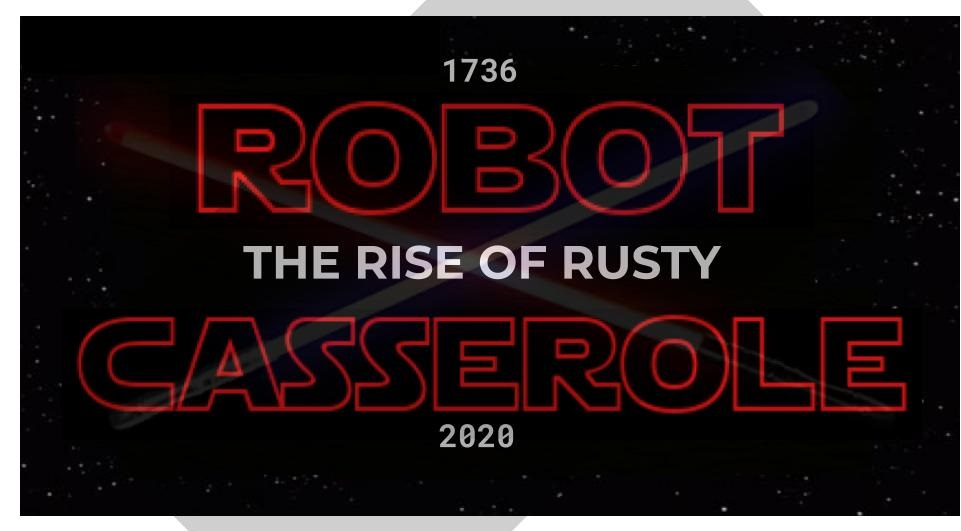

GreenBeanCasserole is Robot Casserole's web based match scouting system
We run this on tablets and get the data from scanning generated QR codes.

## MATCH INFO:
The match info section of this app has the things we need to know befor a match.

First, type in who you are in the scout name bar
Then, choose what type of match they are playing in (qualification, practice, elimination). The settings you choose for this will stay until you change them again.

## AUTO:
This section of the app tells us what this team did in autonomous.

    Power Cells:

        The first section is to keep track of how many power cells they scored in the upper goal.
        
        The second section is to keep track of the amount of power cells they scored in the low goal.

        There is also an "Undo Score" button for any mistakes you make in either of the power cell categories.
    
Also, click on the checkbox if they left the initiation line in auto.

## TELEOP:
This section records what the team did in teleop.

Power cell tracking works the same as in auto.

However, in addition to the power cell tracking, there are also the control panel and climbing sections.

    Control Panel:

        There is a checkbox to track whether or not they spun the wheel the required 3-5 times.

        There is another checkbox to track where or not they rotated the wheel to the designated color.

    Climbing:

        There is a drop-down list of the possible climbing combinations.

            All that is needed is to click on the box and select the one that is appropiate. 
            ie. click on the bubble for "No Climb" if they did not climb and did not sit into their side of the 
            shield generator, the "middle climb" button 
            if they climbed on the center of the coat 
            hanger, etc.

            Also, click on the checkbox if they got points for balancing the coat hanger.

## POST MATCH:
Post match section is all about how they did overall and also where the team shot from.

    Driver Rating:

        Click on the box and select the most appropiate option related to their driving skill.

    Defense Rating:

        Click on the box and select the most appropriate option related to their skill in defending.

    Intake Abilities:

        Click on the checkboxes if they are applicable to the robot. 
        As in, click on the checkbox for "Can Intake from ground?" 
        if they can, indeed, intake from the ground.

Are they prone to getting penalties? If so, click on the penalty prone checkbox.

    Shooting Positions:

        If they can shoot from more than 3 positions, click on the checkbox.

        Otherwise, select up to 3 positions that they have shot from on the image of the field.

        Underneath the image of the field there is also a chart with the positions that you selected. 
        This is to indicate how much time they spent in each of their shooting positions. 
        So if they spent 90% of their time in one shooting posiiton and 10% of their time in a different 
        shooting position, you would move the slider for the first one almost entirely to the right 
        and move the slider for the second one almost entirely to the left.

The comment section is for when you notice something that there is not an option for it in the app.

Once you've done all of this you must submit your report.

## MATCH HISTORY:
Match history is a backup to the data you've entered in the app and is also what the QR code is generated from.

To clear your match history you must have a password. It's meant to prevent accidental clearing of data, which is stored in browser local storage.

## ABOUT:
This section lists the people who have made contributions to the scouting app.